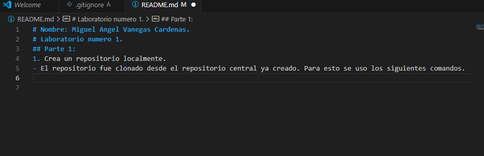
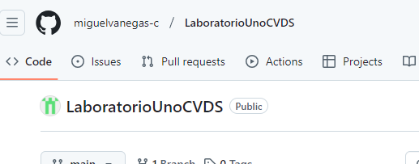
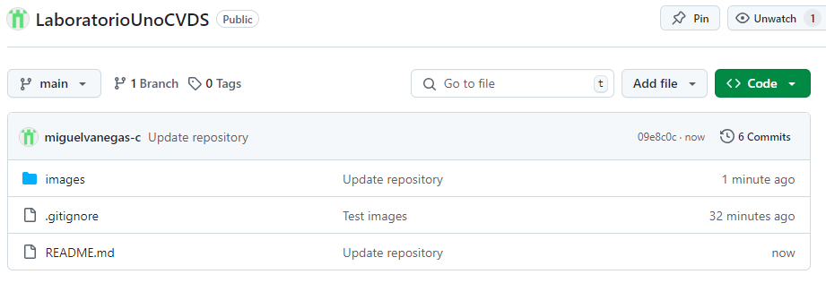
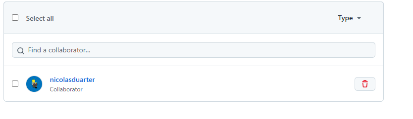
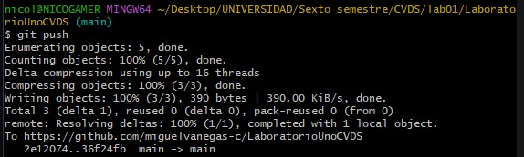

# Nombre: Miguel Angel Vanegas Cardenas.
# Laboratorio numero 1.
- Prueba uso de visual para escribir el README.md.

## Parte 1:
1.  Crea un repositorio localmente.
- El repositorio fue clonado desde el repositorio central ya creado. Para esto se uso los siguientes comandos.
    ```bash
        echo "# LaboratorioUnoCVDS" >> README.md
        git init
        git commit -m "first commit"
        git branch -M main
        git remote add origin https://github.com/miguelvanegas-c/LaboratorioUnoCVDS.git
        git push -u origin main
    ```
2.	Agrega un archivo de ejemplo al repositorio, el **README.md** puede ser una gran opción.
- Para agregar el archivo, primero se crea y despues se usan los siguientes comandos.
    ```bash
        git add .
    ```
    De esta manera ya seria agregado en caso de querer subirlo al repositorio centrar ese necesario hacer lo siguiente.
    ```bash
        git commit -m "Update readme"
        git push -u origin main
    ```
3.	Averigua para qué sirve y como se usan estos comandos **git add** y **git commit -m “mensaje”**
- git add se usa para añadir archivos, el commit funciona como un tipo de pantallazo donde se guarda el estado actual del respositorio, aparte de agregarle un mensaje al commit.
4.  Abre una cuenta de github, si ya la tienes, enlazala con el correo institucional.
- Ya contaba con una cuenta con el correo institucional.
5.	Crea un repositorio en blanco (vacío) e GitHub.
- El repositorio ya fue creado en la primera parte, ya que para crear el repositorio local fue clonado en base al central.

   
6.	Configura el repositorio local con el repositorio remoto.
- Ya fue hecho en la primera parte, debido a que el repositorio fue clonado.
  
7.	Sube los cambios, teniendo en cuenta lo que averiguaste en el punto 3	
- Los cambios en el md hechos hasta el momento han sido subidos, tal y como se muestra en el siguiente pantallazo.

- Se hizo uso de los siguientes comandos
    ```bash
        git add .
        git commit -m "Update repository"
        git push origin main
    ```

8.	Configura el correo en git local de manera correcta
- Para realizar la configuracion se usaron los siguientes comandos.
    ```bash
        git config --global user.name "Miguel Vanegas"
        git config --global user.email "miguel.vanegas-c@mail.escuelaing.edu.co"

    ```

9.	Vuelve a subir los cambios y observa que todo esté bien en el repositorio remoto (en GitHub).
- Los cambios se realizaron de forma correcta.

## Parte 2.
### Trabajo en parejas.
### Nombre Compañero: Nicolas Andres Duarte Rodriguez.
1.	Se escogen los roles para trabajar en equipo, una persona debe escoger ser "Owner" o Propietario del repositorio y la otra "Collaborator" o Colaborador en el repositorio.
- Yo (Miguel Vanegas) sere el propetario y mi compañero (Nicolas Duarte) el colaborador.
2.	El owner agrega al colaborador con permisos de escritura en el repositorio que creó en la parte 1. 
- 
3.	El owner le comparte la url via Teams al colaborador
4.	El colaborador acepta la invitación al repositorio
- La invitacion fue aceptada, por lo tanto ya es colaborador.

5.	Owner y Colaborador editan el archivo README.md al mismo tiempo e intentan subir los cambios al mismo tiempo.
6.	¿Que sucedió?
- Solo tomo los cambios del owner.
Y lanzo los iguientes menssajes:
En el caso del propietario.

En el caso del colaborator.
7.	La persona que perdió la competencia de subir los cambios, tiene que resolver los conflictos, cúando haces pull de los cambios, los archivos tienen los símbolos `<<<` `===` y `>>>` (son normales en la resolución de conflictos), estos conflictos debes resolverlos manualmente.
         [Como resolver Conflictos GitHub](https://docs.github.com/es/enterprise-cloud@latest/pull-requests/collaborating-with-pull-requests/addressing-merge-conflicts/resolving-a-merge-conflict-on-github)
         
8.	Volver a repetir un cambio sobre el README.md ambas personas al tiempo para volver a tener conflictos.
   
9.	Resuelvan el conflicto con IntelliJ si es posible,  [Resolver conflictos en IntelliJ]( https://www.jetbrains.com/help/idea/resolving-conflicts.html#distributed-version-control-systems)

De esta forma ya sabes resolver conflictos directamente sobre los archivos y usando un IDE como IntelliJ, esto te será muy útil en los futuros trabajos en equipo con Git.

cambio nicolas x2 jiji
