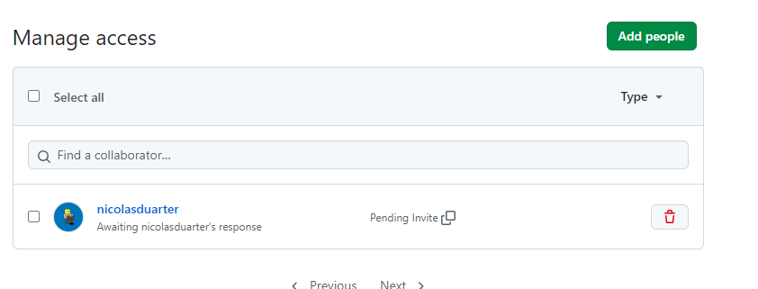
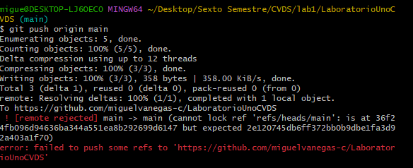
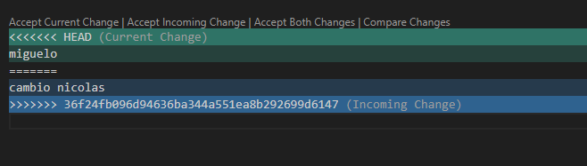
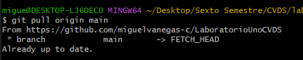
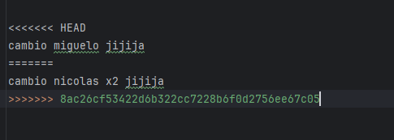
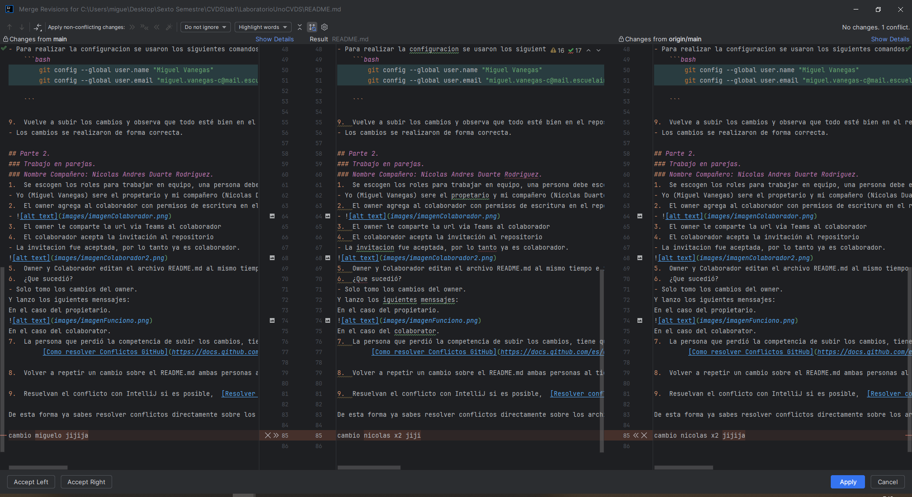
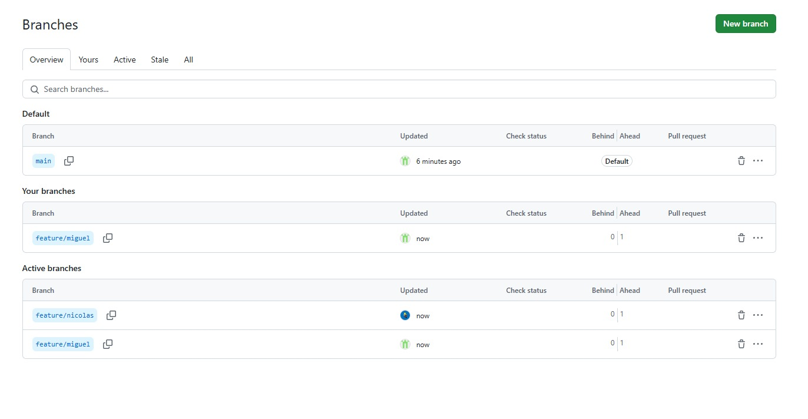
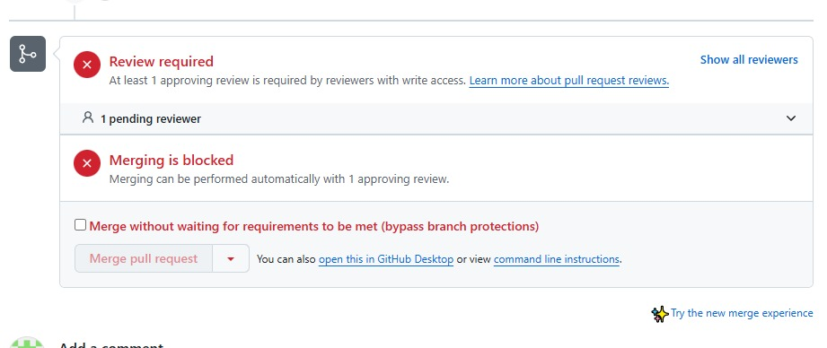
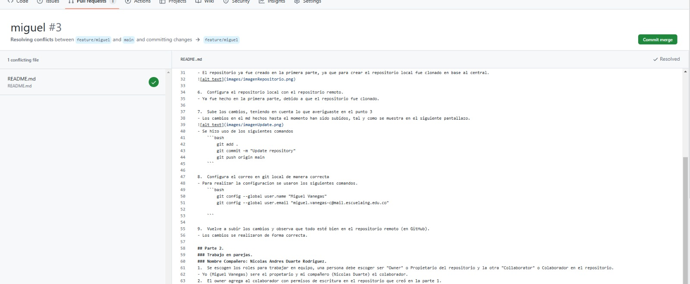

# Integrantes
### Miguel Angel Vanegas Cardenas
### Nicolas Andres Duarte
# Description
- En este repositorio se realizo un tutorial para aprender las bases del uso de github.
# Laboratorio numero 1.
- Prueba uso de visual para escribir el README.md.
  
## Parte 1:
1.  Crea un repositorio localmente.
- El repositorio fue clonado desde el repositorio central ya creado. Para esto se uso los siguientes comandos.
    ```bash
        echo "# LaboratorioUnoCVDS" >> README.md
        git init
        git commit -m "first commit"
        git branch -M main
        git remote add origin https://github.com/miguelvanegas-c/LaboratorioUnoCVDS.git
        git push -u origin main
    ```
2.	Agrega un archivo de ejemplo al repositorio, el **README.md** puede ser una gran opción.
- Para agregar el archivo, primero se crea y despues se usan los siguientes comandos.
    ```bash
        git add .
    ```
  De esta manera ya seria agregado en caso de querer subirlo al repositorio centrar ese necesario hacer lo siguiente.
    ```bash
        git commit -m "Update readme"
        git push -u origin main
    ```
3.	Averigua para qué sirve y como se usan estos comandos **git add** y **git commit -m “mensaje”**
- git add se usa para añadir archivos, el commit funciona como un tipo de pantallazo donde se guarda el estado actual del respositorio, aparte de agregarle un mensaje al commit.
4.  Abre una cuenta de github, si ya la tienes, enlazala con el correo institucional.
- Ya contaba con una cuenta con el correo institucional.
5.	Crea un repositorio en blanco (vacío) e GitHub.
- El repositorio ya fue creado en la primera parte, ya que para crear el repositorio local fue clonado en base al central.
  

6.	Configura el repositorio local con el repositorio remoto.
- Ya fue hecho en la primera parte, debido a que el repositorio fue clonado.

7.	Sube los cambios, teniendo en cuenta lo que averiguaste en el punto 3
- Los cambios en el md hechos hasta el momento han sido subidos, tal y como se muestra en el siguiente pantallazo.


- Se hizo uso de los siguientes comandos
    ```bash
        git add .
        git commit -m "Update repository"
        git push origin main
    ```

8.	Configura el correo en git local de manera correcta
- Para realizar la configuracion se usaron los siguientes comandos.
    ```bash
        git config --global user.name "Miguel Vanegas"
        git config --global user.email "miguel.vanegas-c@mail.escuelaing.edu.co"

    ```

9.	Vuelve a subir los cambios y observa que todo esté bien en el repositorio remoto (en GitHub).
- Los cambios se realizaron de forma correcta.

## Parte 2.
### Trabajo en parejas.
1.	Se escogen los roles para trabajar en equipo, una persona debe escoger ser "Owner" o Propietario del repositorio y la otra "Collaborator" o Colaborador en el repositorio.
- Yo (Miguel Vanegas) sere el propetario y mi compañero (Nicolas Duarte) el colaborador.
2.	El owner agrega al colaborador con permisos de escritura en el repositorio que creó en la parte 1.



3.	El owner le comparte la url via Teams al colaborador
4.	El colaborador acepta la invitación al repositorio
- La invitacion fue aceptada, por lo tanto ya es colaborador.


5.	Owner y Colaborador editan el archivo README.md al mismo tiempo e intentan subir los cambios al mismo tiempo.
6.	¿Que sucedió?
- Solo tomo los cambios del colaborador.
  Y lanzo los siguientes menssajes:
  En el caso del colaborador.


En el caso del propietario.



7.	La persona que perdió la competencia de subir los cambios, tiene que resolver los conflictos, cúando haces pull de los cambios, los archivos tienen los símbolos `<<<` `===` y `>>>` (son normales en la resolución de conflictos), estos conflictos debes resolverlos manualmente.
      [Como resolver Conflictos GitHub](https://docs.github.com/es/enterprise-cloud@latest/pull-requests/collaborating-with-pull-requests/addressing-merge-conflicts/resolving-a-merge-conflict-on-github)
- Los conflictos fueron los siguientes.



Se solucionan y acto seguido se realiza el add, commit y pull.




8.	Volver a repetir un cambio sobre el README.md ambas personas al tiempo para volver a tener conflictos.
- Al hacer el cambio de nuevo gano el colaborador.
-


9.	Resuelvan el conflicto con IntelliJ si es posible,  [Resolver conflictos en IntelliJ]( https://www.jetbrains.com/help/idea/resolving-conflicts.html#distributed-version-control-systems)
- En la parte de arriba de intellij sale un mensaje para solucionar los conflictos, se oprime y lanza la siguiente ventana.



Después de confirmar que los cambios son los esperados, aplicamos la resolucion.
De esta forma ya sabes resolver conflictos directamente sobre los archivos y usando un IDE como IntelliJ, esto te será muy útil en los futuros trabajos en equipo con Git.


## PARTE III (Trabajo de a parejas)
1.	¿Hay una mejor forma de trabajar con git para no tener conflictos?
- Usando git flow, la cual proporciona una estructura basica para trabajar en git, usando una rama main, una rama development y diferentes ramas de features,
  donde se trabajan los comportamientos a desarrollar de la aplicación por separado.
2.	¿Qué es y como funciona el **Pull Request**?
- Un Pull Request (PR) es una solicitud para que los cambios realizados en una rama de un repositorio sean revisados e integrados en otra rama,
  generalmente en la rama principal (main) o de desarrollo (develop).
3.	Creen una rama cada uno y suban sus cambios
- Cada uno crea una rama, (En el caso del colaborador feature/nicolas y en el caso del propietario feature/miguel).
  
  Se realizaron pequeños cambios en el readme y se realizó un push a las respectivas ramas.
4.	Tanto owner como colaborador hacen un cambio en el README.md y hacen un Pull Request (PR) a la rama main/master
- Ya con los cambios hechos se realiza cada uno un pull request a la rama main, ambos pull request requerían de la revision antes del otro.
  Primero se realizó la revision del cambio hecho por el colaborador, sin tener ningún problema al hacer el merge.
  Después se realizó el mismo procedimiento para el cambio realizado por el propietario, pero en este caso si hubo conflictos.
  
  **(Recomendación : deben trabajar en equipo y distribuirse de mejor manera quien va a modificar qué, para evitar modificar los mismos archivos al mismo tiempo, si no se editan los mismos archivos la resolución de conflictos es automática)**

5.	Teniendo en cuenta la recomendación, mezclen los cambios a la rama main a través de PR con el check/review/approval del otro compañero (Cuando se hace merge se deberían borrar las ramas en github)
- Se realiza la corección de los conflictos, se corrigen y se confirma el merge.
  
  Ahora ya permite realizar el merge.


